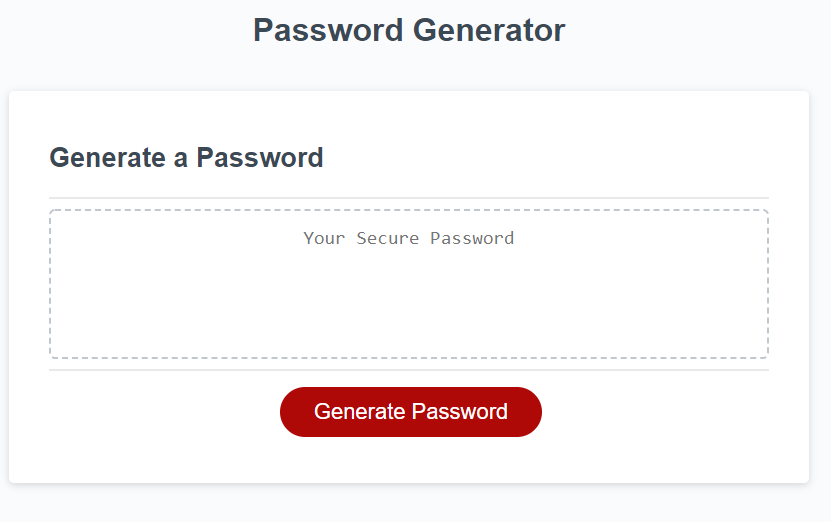

# Password Generator Starter Code

## Created a random password generator usin JavaScript
Original HTML and CSS provided by UT Bootcamp, made the password generator functional using JavaScript.

Link to website: https://anaumov1.github.io/password-generator/

## Table of contents
* [Installation](#installation)
* [Usage](#usage)
* [Credits](#credits)
* [License](#license)

## Installation

To install all the files for the "Password Generator" website please clone this https://github.com/anaumov1/password-generator.git repository to your computer. For instructions on how to clone a repository from GitHub follow this link: https://docs.github.com/en/github/creating-cloning-and-archiving-repositories/cloning-a-repository

## Usage

To use the "Password Generator" navigane to the site, once on the site click on the "Generate Password" button, after a series of questions the new random password will appear in the window above the button. !!! Important !!! please make sure to read the prompts and follow instructions.

## Credits
The project was completed by Alexandru Naumov, special thanks to UT Bootcamp instructor and TA's for the assistance provided for this website. Original HTML and CSS code provided by UT Coding Bootcamp

## Licence

Copyright (c) [2021] [Alexandru Naumov]

Permission is hereby granted, free of charge, to any person obtaining a copy
of this software and associated documentation files (the "Software"), to deal
in the Software without restriction, including without limitation the rights
to use, copy, modify, merge, publish, distribute, sublicense, and/or sell
copies of the Software, and to permit persons to whom the Software is
furnished to do so, subject to the following conditions:

The above copyright notice and this permission notice shall be included in all
copies or substantial portions of the Software.

THE SOFTWARE IS PROVIDED "AS IS", WITHOUT WARRANTY OF ANY KIND, EXPRESS OR
IMPLIED, INCLUDING BUT NOT LIMITED TO THE WARRANTIES OF MERCHANTABILITY,
FITNESS FOR A PARTICULAR PURPOSE AND NONINFRINGEMENT. IN NO EVENT SHALL THE
AUTHORS OR COPYRIGHT HOLDERS BE LIABLE FOR ANY CLAIM, DAMAGES OR OTHER
LIABILITY, WHETHER IN AN ACTION OF CONTRACT, TORT OR OTHERWISE, ARISING FROM,
OUT OF OR IN CONNECTION WITH THE SOFTWARE OR THE USE OR OTHER DEALINGS IN THE
SOFTWARE.
